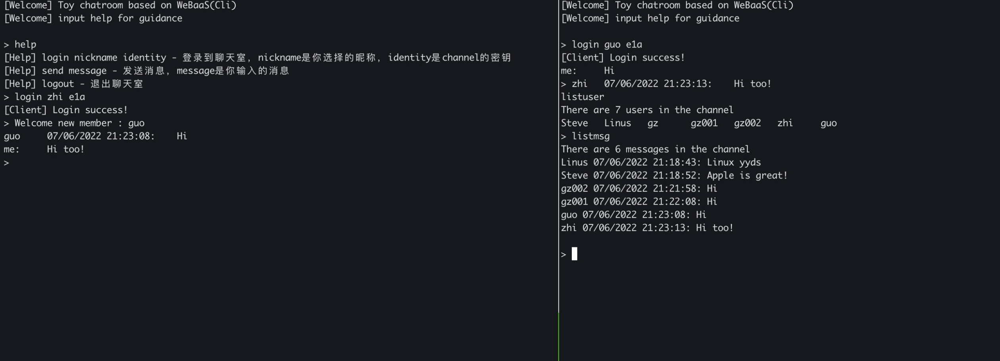
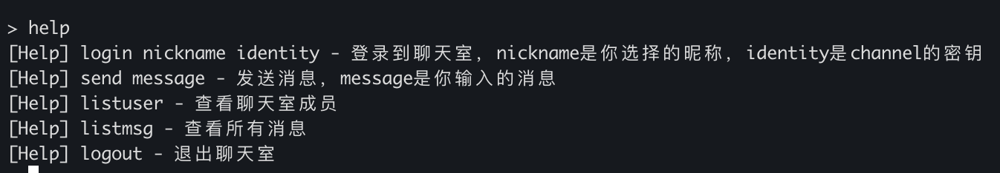

<div align="center">
    <h1>WeBaaS ChatRoom</h1>
    <h6>一个基于WeBaaS(A simplified MBaaS system)实现的纯命令行聊天室</h6>
</div>

# 预览



# 环境

* `python` 版本 `3+`
* protoc

# 运行方法

## 注册新应用(可跳过)

由于项目已经向WeBaaS注册过应用，所以这一步骤可以跳过。如果更新了proto文件或者重新开启一个聊天室，则需要执行这个步骤

进入项目根目录，执行命令：

```shell
protoc -I=./proto/ --python_out=./ ./proto/*.proto
```
这一步骤是根据chatroom.proto更新序列化结果


```shell
python3 ./setup.py
```
这一步骤将向WeBaaS注册应用，应用id将存储在文件中

## 运行应用

进入项目根目录，执行命令：

```shell
python3 ./client_start.py
```

来启动聊天室客户端

### 客户端命令

运行之后，你可以在客户端输入命令来使用聊天室功能，输入：

```shell
help
```

可以获取帮助，输入：

```shell
login ${nickname} ${identity}
```

可以以 `${nickname}` 作为用户名登录输入，`${identity}`是appID的前3位，作为聊天室的密钥

```shell
send ${message}
```

可以发送消息 `${message}` 给聊天室登录的所有用户

```shell
listmsg
```

可以查看历史聊天信息

```shell
listmsg
```

可以查看聊天室所有成员

# 系统架构

## 数据库设计


数据库包括三个表: Accounts, Message, Channel.

Channel包括这个频道里面的所有用户和聊天内容。

Message包括消息内容，消息时间戳，消息发送者。

Accounts包括用户id和昵称。

## 多线程

发送消息会开启一个子线程来发送消息。

```
# Start child thread to send messages
thread = threading.Thread(target=self.__send_message_thread, args=(message,))
thread.setDaemon(True)
thread.start()
```

用户在登录之后就会有一个子线程通过websocket监听WeBaaS的notification。

```
# Start child thread to receive messages
thread = threading.Thread(target=self.__receive_message_thread)
thread.setDaemon(True)
thread.start()
```

## 与WeBaaS交互

使用了WeBaaS的6个接口，包括app, schema, query, record, notification register, and notification listen.

以发送与接收消息为例
当用户发送一条消息的时候，我们将用户的消息添加到Channel中，并通过record接口发送给WeBaaS。这个channel中的其他用户的客户端由于正在监听这个channel，它们会收到channel被更新的通知，并通过query请求从WeBaaS中拿到channel中的最新内容。从最新的channel中找到新的消息，并展示给用户。

这里给出监听notification的代码展示:

```
websocket_url = websocket_endpoint+'/notification?appID={}&notificationID={}'.format(appID, self.__notification_id)
async def listen_to_websocket():
    async with websockets.connect(websocket_url) as websocket:
        await websocket.recv()
        # only support one channel, to need to extract channel id
        self.__pull_channel()

loop = asyncio.new_event_loop()
asyncio.set_event_loop(loop)
while True:
    asyncio.get_event_loop().run_until_complete(listen_to_websocket())
```

从以上代码中可以看出，客户端会通过一个websocket来监听WeBaaS的notification，如果WeBaaS通知说某个channel有更新，客户端会通过`__pull_channel`从WeBaaS中拿到channel最新的内容。

## 与用户交互

用户能够通过login命令登录，通过send命令发送消息，通过listmsg查看历史消息，通过listuser查看所有用户，通过logout登出。



## 成员分工情况:

郭志: app setup和notification.

王祖来: proto 设计和项目python框架.

刘宇轩: 用户登录与加入channel.

张德鑫: proto设计和发消息.

