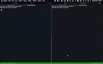
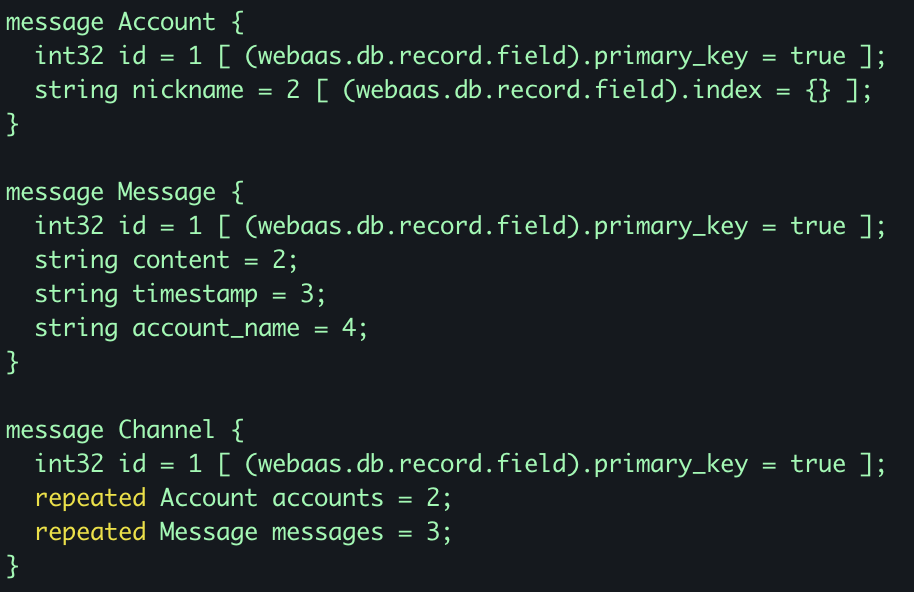

<!--
backgroundImage: url('assets/bg-lead.png')
footer: "Presented by Zhi Guo"
-->

# A ChatRoom based on WeBaaS

group 5

---

<!--
backgroundImage: url('assets/bg-outline.png')
footer: ""
-->

## Outline

- Project Overview
- Disign and implementation
- Summary

---

## Outline

- **Project Overview ◁**
- Disign and implementation
- Summary

---

<!--
backgroundImage: url('assets/bg.png')
-->

## Project Overview

Our front-end is command-line-based which is a typical IRC style.

Our chatroom support real time communication, password mechanism, chat history display, member display. 

We used 6 WeBaaS APIs: app, schema, query, record, notification register, and notification listen.

---

## Project Overview

---

<!--
backgroundImage: url('assets/bg-outline.png')
footer: ""
-->

## Outline

- **Project Overview ◁**
- Disign and implementation
- Summary

---

<!--
backgroundImage: url('assets/bg.png')
-->

## Proto structure

---

## Application setup

Use WeBaaS app API to register application.

Use WeBaaS schema API to upload and update schema.

Save application ID in local file.

---

## User login 

Use application ID first three characters as password to login.

Create an account when login.

Join the channel when account is created.

---

## Communication (Sender)

User send message to WeBaaS in command line.

A child process is started to send message in order to response to user quickly.

Use WeBaaS record API to add message in channel.

---

## Communication (Receiver)

Register a notification id to listen the channel when user joined.

Start a child thread to listen to the notification id by websocket.

When websocket is notified, pull latest data in channel and show the new chats.

---

## Misc

User can query users in channel by `listuser` command.

User can query history message by `listmsg` command.

Use Python cmd package to handle different commands.

---

<!--
backgroundImage: url('assets/bg-outline.png')
-->

## Outline

- Project Overview
- Disign and implementation
- **Summary◁**

---

<!--
backgroundImage: url('assets/bg.png')
-->

## Task assignment

GZ: app setup and notification.
WZL: proto design and python framework.
LYX: user login.
ZDX: proto design and message send.

---

## LoC

350 lines of python.

---

Thanks for your attentation!

